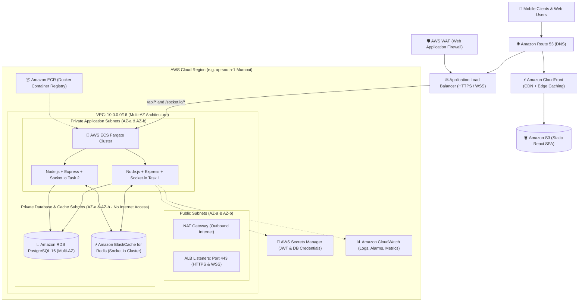
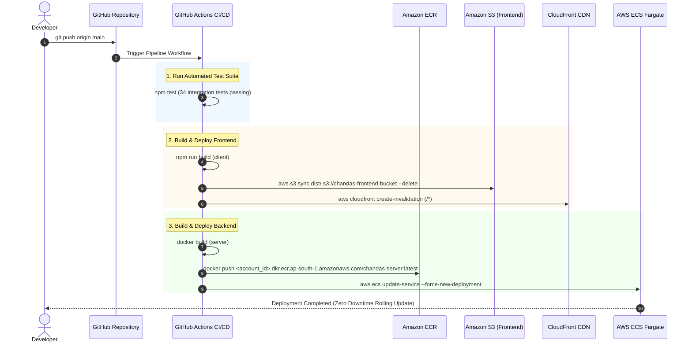

# ☁️ AWS Cloud Infrastructure Architecture & Deployment Plan

## 1. High-Level Architecture Overview

This plan outlines the production-ready, highly available, secure, and scalable cloud infrastructure on **Amazon Web Services (AWS)** for the **Vinayaka Chavithi Chandas Collection & Real-Time Audit Platform**.



---

## 2. Infrastructure Components Specification

### 🌐 A. Edge, CDN & Frontend Layer
| AWS Service | Configuration | Purpose |
|---|---|---|
| **Amazon Route 53** | Public Hosted Zone with Alias Records | High-availability DNS routing for custom domain (e.g. `chandas.yourdomain.com`). |
| **AWS Certificate Manager (ACM)** | Wildcard SSL/TLS Certificate (`*.yourdomain.com`) | Free auto-renewing HTTPS/TLS encryption for CloudFront and ALB. |
| **Amazon CloudFront** | Global Edge CDN with Origin Access Control (OAC) | Ultra-fast static asset delivery with global edge caching and Gzip/Brotli compression. |
| **Amazon S3** | Private Bucket with SSE-S3 Encryption | Hosts compiled React SPA production build (`/dist`), accessible only via CloudFront OAC. |

---

### ⚖️ B. Application & Routing Layer
| AWS Service | Configuration | Purpose |
|---|---|---|
| **AWS WAF** | Rate Limiting + Common OWASP Core Rule Set | Protects API from DDoS attacks, brute-force login attempts, and malicious bots. |
| **Application Load Balancer (ALB)** | Dual-AZ with HTTPS (Port 443) & HTTP➔HTTPS Redirect | Routes REST requests (`/api/*`) and handles persistent WebSocket connections (`/socket.io/*`) with sticky sessions. |

---

### 🚀 C. Compute & Container Orchestration (Backend)
| AWS Service | Configuration | Purpose |
|---|---|---|
| **AWS ECS (Fargate)** | Serverless Docker Container Tasks (0.5 vCPU / 1 GB RAM) | Runs `chandas-server` container without managing EC2 instances. |
| **Auto Scaling Target** | Target Tracking (CPU > 70% or Active Sockets > 1000) | Automatically scales backend tasks from 2 to 10 instances during high-traffic festival peaks. |
| **Amazon ECR** | Private Docker Registry with Image Vulnerability Scanning | Stores versioned production Docker images (`chandas-server:v1.0.0`). |

---

### 🗄️ D. Database & Cache Layer
| AWS Service | Configuration | Purpose |
|---|---|---|
| **Amazon RDS for PostgreSQL** | PostgreSQL 16, `db.t4g.small` / `db.t4g.medium` (Multi-AZ) | Managed database with automatic failover, automated daily snapshots, and KMS encryption at rest. |
| **Amazon ElastiCache (Redis)** | Redis OSS Cluster (`cache.t4g.micro`) | Manages Socket.io room synchronization across multiple ECS Fargate tasks using `@socket.io/redis-adapter`. |

---

### 🔐 E. Security, IAM & Observability
| AWS Service | Configuration | Purpose |
|---|---|---|
| **AWS Secrets Manager** | Encrypted Secret Store | Stores `DATABASE_URL` and `JWT_SECRET`, fetched securely by ECS tasks at startup. |
| **AWS IAM** | Least-Privilege Execution & Task Roles | Restricts ECS task permissions to only Secrets Manager and CloudWatch Logs. |
| **Amazon CloudWatch** | Log Groups + Container Insights + Metric Alarms | Real-time centralized logging, error monitoring, and email alerts for high CPU / database connection spikes. |

---

## 3. Network Architecture & Subnet Segmentation

```
VPC CIDR: 10.0.0.0/16 (Region: ap-south-1 Mumbai)
├── Availability Zone A (ap-south-1a)
│   ├── Public Subnet A:       10.0.1.0/24  (ALB, NAT Gateway A)
│   ├── Private App Subnet A:   10.0.10.0/24 (ECS Fargate Tasks)
│   └── Private DB Subnet A:    10.0.20.0/24 (RDS Primary, ElastiCache Node 1)
│
└── Availability Zone B (ap-south-1b)
    ├── Public Subnet B:       10.0.2.0/24  (ALB Standby, NAT Gateway B)
    ├── Private App Subnet B:   10.0.11.0/24 (ECS Fargate Tasks)
    └── Private DB Subnet B:    10.0.21.0/24 (RDS Standby Replica, ElastiCache Node 2)
```

### 🛡️ Security Group Ingress / Egress Matrix

| Security Group | Inbound Rules (Ingress) | Outbound Rules (Egress) |
|---|---|---|
| **`alb-sg`** | Port 80 & 443 from `0.0.0.0/0` | All traffic to `ecs-sg` on port 5000 |
| **`ecs-sg`** | Port 5000 from `alb-sg` ONLY | Port 5432 to `rds-sg`, Port 6379 to `redis-sg`, HTTPS (443) via NAT |
| **`rds-sg`** | Port 5432 from `ecs-sg` ONLY | None |
| **`redis-sg`** | Port 6379 from `ecs-sg` ONLY | None |

---

## 4. CI/CD Deployment Pipeline



---

## 5. Cost Estimation & Tier Comparison

| Tier | Target Traffic | Key Services | Estimated Monthly Cost |
|---|---|---|---|
| **Tier 1: Starter / Dev** | < 500 concurrent users | 1x EC2 (`t4g.small`), RDS PostgreSQL (`db.t4g.micro`), S3 + CloudFront | **~$25 – $40 / month** |
| **Tier 2: Production (Recommended)** | 5,000+ concurrent collectors | Multi-AZ RDS (`db.t4g.small`), 2x ECS Fargate tasks, ALB, S3 + CloudFront, ElastiCache Redis | **~$80 – $140 / month** |
| **Tier 3: Enterprise Scale** | 50,000+ transactions/day | Multi-AZ RDS (`db.m6g.large`), Auto-scaled ECS Fargate (2-10 tasks), AWS WAF, ElastiCache Redis | **~$250 – $450 / month** |

---

## 6. Phased Implementation Roadmap

### 🏁 Phase 1: Foundation & Network Setup
- [ ] Create AWS Account & configure AWS CLI with IAM Administrator.
- [ ] Deploy VPC with 6 subnets across 2 AZs using **Terraform** or **AWS CDK**.
- [ ] Configure Route 53 Hosted Zone and request ACM SSL Certificate.

### 🗄️ Phase 2: Database & Secret Provisioning
- [ ] Provision Amazon RDS PostgreSQL 16 (Multi-AZ) in private DB subnets.
- [ ] Store database password and `JWT_SECRET` in AWS Secrets Manager.
- [ ] Run `init-db.sql` schema and trigger initialization.

### 🚀 Phase 3: Containerization & Backend Deployment
- [ ] Create Amazon ECR repository for `chandas-server`.
- [ ] Define ECS Task Definition and Service with Application Load Balancer.
- [ ] Configure Target Group health check on `/api/health` with WebSocket sticky routing.

### ⚡ Phase 4: Frontend Hosting & CDN
- [ ] Create private S3 bucket and upload React `/dist` assets.
- [ ] Configure CloudFront distribution with Origin Access Control (OAC).
- [ ] Map CloudFront and ALB under Route 53 custom domain records.

### 🔄 Phase 5: CI/CD Pipeline Automation
- [ ] Add GitHub Actions workflow (`.github/workflows/deploy.yml`) for automated testing, image building, and zero-downtime rolling deployments.
