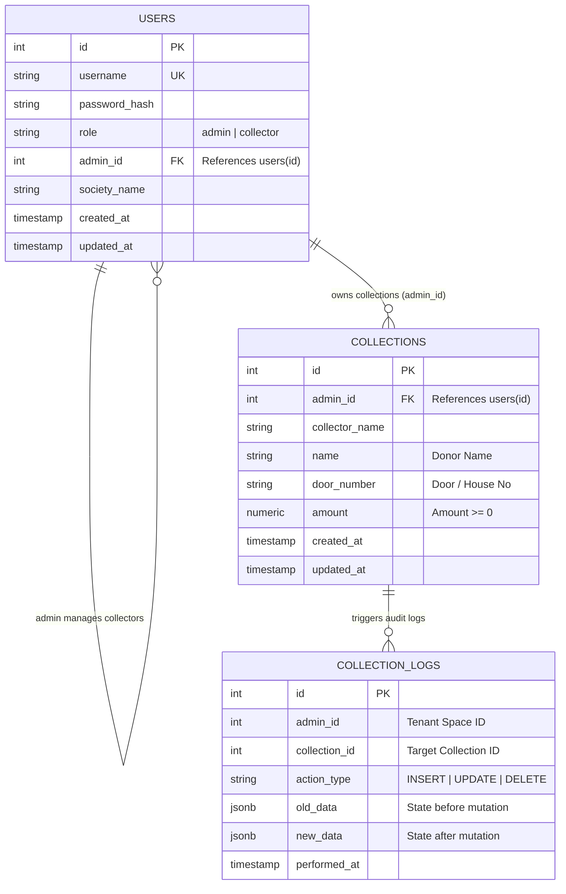
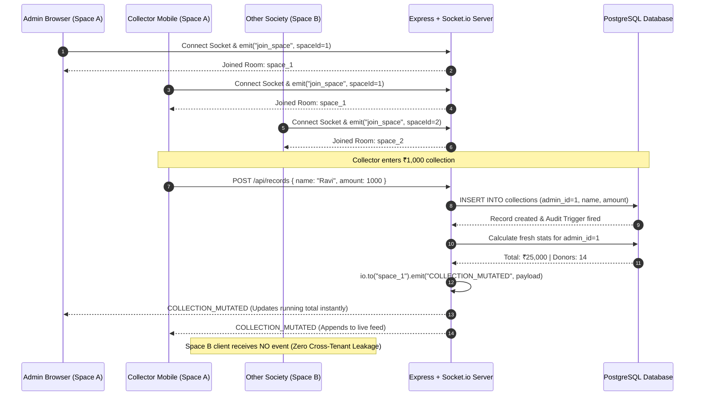

# 🏛️ System Architecture & Design Document

## 1. High-Level Architecture Overview

The Vinayaka Chavithi Chandas Collection platform is built as a **Multi-Tenant Full-Stack Real-Time Web Application** designed for high reliability, concurrent data entry, zero-latency live updates, and immutable audit tracking.

```mermaid
graph TD
    Client1["📱 Mobile / Desktop Client (Admin)"]
    Client2["📱 Mobile / Desktop Client (Collector)"]
    
    subgraph "Nginx & Reverse Proxy Layer (Port 80/5173)"
        Nginx["Nginx Web Server / Vite Dev Proxy"]
    end

    subgraph "Application API & Realtime Layer (Port 5000)"
        Express["Express.js REST API"]
        AuthMiddleware["JWT Authentication Middleware"]
        SocketIO["Socket.io Server (Room Partitioned)"]
        Controllers["Controllers (Multi-Tenant Scoped)"]
    end

    subgraph "Persistence & Audit Layer (Port 5432)"
        PgPool["PostgreSQL Connection Pool (pg)"]
        UsersTable[("Table: users (Bcrypt Hash)")]
        CollectionsTable[("Table: collections (admin_id Scoped)")]
        TriggerFunction["⚙️ PL/pgSQL Trigger: log_collection_changes()"]
        AuditLogsTable[("Table: collection_logs (JSONB History)")]
    end

    Client1 --> Nginx
    Client2 --> Nginx
    Nginx -->|/api/*| Express
    Nginx -->|/socket.io/*| SocketIO
    
    Express --> AuthMiddleware
    AuthMiddleware --> Controllers
    Controllers --> PgPool
    
    PgPool --> UsersTable
    PgPool --> CollectionsTable
    
    CollectionsTable -.->|AFTER INSERT/UPDATE/DELETE| TriggerFunction
    TriggerFunction -->|Auto Logs Old/New Snapshots| AuditLogsTable
    
    Controllers -->|io.to(space_id).emit()| SocketIO
    SocketIO -.->|Live Event: COLLECTION_MUTATED| Client1
    SocketIO -.->|Live Event: COLLECTION_MUTATED| Client2
```

---

## 2. Multi-Tenancy & Space Isolation Model

Each festival society or committee represents an independent **Collection Space** identified by an `admin_id`.

```
                    ┌────────────────────────┐
                    │     PostgreSQL DB      │
                    └───────────┬────────────┘
                                │
        ┌───────────────────────┴───────────────────────┐
        ▼                                               ▼
┌───────────────────────────────┐       ┌───────────────────────────────┐
│   SPACE 1: "GovindaNagar"     │       │   SPACE 2: "SaiNagar Colony"  │
│   Space ID (Admin): 1         │       │   Space ID (Admin): 10        │
│                               │       │                               │
│   Users:                      │       │   Users:                      │
│    • GovindaNagar (Admin)     │       │    • SaiAdmin (Admin)         │
│    • RameshCollector (Collector)│     │    • SureshCollector (Collector)│
│                               │       │                               │
│   Collections (admin_id = 1): │       │   Collections (admin_id = 10):│
│    • ₹1,500 (Door: 1-12)      │       │    • ₹5,000 (Door: 12-34)     │
│    • ₹2,500 (Door: 1-13)      │       │    • ₹2,500 (Door: 12-35)     │
│   Total: ₹4,000               │       │   Total: ₹7,500               │
└───────────────────────────────┘       └───────────────────────────────┘
```

### Key Security & Scoping Invariants:
1. **Admin Registration:** Anyone registering via `/api/auth/register` creates a new Admin account and initiates a new independent collection space.
2. **Collector Creation:** Only Admins (`role === 'admin'`) can create Collectors via `/api/users`. The created collector is permanently bound to that Admin's `admin_id`.
3. **Query Scoping:** Every SQL read/write query in `collectionController.js` and `historyController.js` explicitly includes `WHERE admin_id = req.user.adminId`.
4. **Foreign Key Cascade:** Deleting an admin space automatically cascades and purges all associated collectors, collection entries, and audit logs cleanly.

---

## 3. Database Entity Relationship Diagram (ERD)



---

## 4. Automated PL/pgSQL Audit Trigger

Audit logging is handled at the **database engine level** using a PostgreSQL trigger function, guaranteeing that no collection insert, edit, or deletion goes unrecorded, even if modified through direct SQL queries or external tools.

```sql
CREATE OR REPLACE FUNCTION log_collection_changes()
RETURNS TRIGGER AS $$
BEGIN
    IF (TG_OP = 'INSERT') THEN
        INSERT INTO collection_logs (admin_id, collection_id, action_type, new_data)
        VALUES (NEW.admin_id, NEW.id, 'INSERT', to_jsonb(NEW));
        RETURN NEW;
    ELSIF (TG_OP = 'UPDATE') THEN
        NEW.updated_at = CURRENT_TIMESTAMP;
        INSERT INTO collection_logs (admin_id, collection_id, action_type, old_data, new_data)
        VALUES (NEW.admin_id, NEW.id, 'UPDATE', to_jsonb(OLD), to_jsonb(NEW));
        RETURN NEW;
    ELSIF (TG_OP = 'DELETE') THEN
        INSERT INTO collection_logs (admin_id, collection_id, action_type, old_data)
        VALUES (OLD.admin_id, OLD.id, 'DELETE', to_jsonb(OLD));
        RETURN OLD;
    END IF;
    RETURN NULL;
END;
$$ LANGUAGE plpgsql;
```

---

## 5. Real-Time Socket.io Lifecycle


